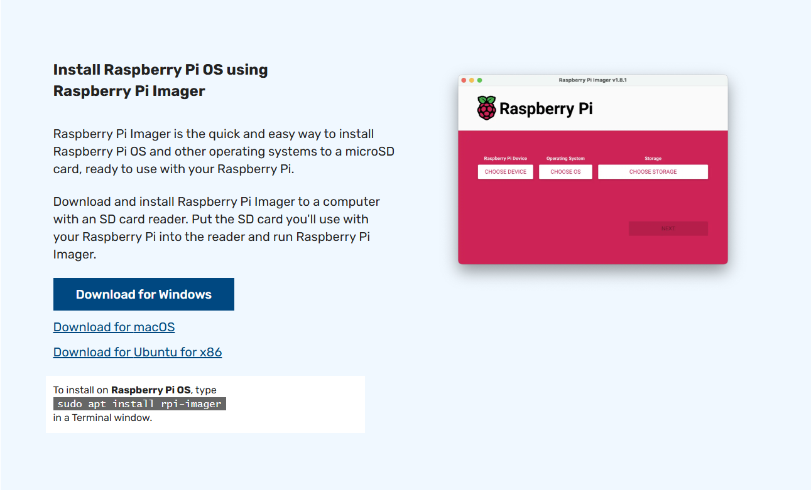

# iot-raspi-2025
IoT 개발자 Raspberry Pi 학습리포지토리 2025

## 1일차

### Raspberry Pi OS 설치 및 무선 설정 가이드 (Windows 기준)

### 1. Raspberry Pi Imager 다운로드 및 실행

- Raspberry Pi 공식 사이트 접속  
    - [https://www.raspberrypi.com/software/](https://www.raspberrypi.com/software/)

- **"Download for Windows"** 버튼 클릭하여 `.exe` 파일 다운로드

    

- 다운로드 완료 후 `.exe` 파일 실행

### 2. 설치 및 설정
1. **장치 선택**  
    - 사용하는 Raspberry Pi 모델 선택
2. **OS 선택**  
    - 원하는 Raspberry Pi OS 선택
3. **저장 장치 선택**  
    - 마이크로 SD 카드 선택

        

4. **설정 편집**
    - 라즈베리파이 디바이스, 운영체제, 저장소 설정 후 다음 클릭

    - OS 커스터마이징 설정을 적용
        - 설정을 편집하기 클릭

            

        - **Hostname**: 라즈베리파이의 네트워크 이름 지정  
        - **사용자 이름 및 비밀번호**: SSH 접속용 계정 설정  

        - **무선 네트워크 설정**
            - SSID : Wi-Fi 이름 입력 (공유기의 네트워크 이름 확인 후 입력)  
            - Password: Wi-Fi 비밀번호 입력  
            - 무선 LAN 국가 : `KR` (대한민국)

        - **로케일 설정**
            - 키보드 레이아웃: `kr`  
            - 언어/지역 설정: 한국어로 지정

        - **서비스**
            - SSH 활성화 체크 (원격 접속용)

5. 설정 후 ->  **저장** 클릭  -> 설치 진행


### 3. 공유기에서 Wi-Fi 정보 확인

- 웹 브라우저에서 `와이파이 IP` 접속
- 로그인 후 **[관리도구] → [무선랜 관리] → [Wi-Fi 기본설정]** 메뉴 이동
- **네트워크 이름 (SSID)** 및 **비밀번호** 확인


### 4. 소프트웨어 추가 다운로드

#### VNC Viewer 다운로드 (원격 데스크탑 연결용)

- VNC Viewer 공식 다운로드 페이지
    - [https://www.realvnc.com/en/connect/download/viewer/](https://www.realvnc.com/en/connect/download/viewer/)

- 사용 중인 OS(예: Windows)에 맞는 설치 파일 다운로드

#### SD Card Formatter 다운로드 (SD 카드 초기화용)

- SD 카드 포맷 공식 유틸리티
    - [https://www.sdcard.org/downloads/formatter/](https://www.sdcard.org/downloads/formatter/)
- Windows 또는 macOS용 다운로드 및 설치
- 마이크로 SD 카드 삽입 후 포맷 진행 (옵션: Quick Format 추천)

### 5. Raspberry Pi VNC 원격 접속 설정

#### SSH 접속 (PuTTY 사용)

1. **PuTTY 실행**  
2. Host Name에 **라즈베리파이 IP 주소 입력**  
    - 예: `192.168.0.xxx`
3. Port는 기본값 `22`, 연결 타입 `SSH`로 설정 후 `Open` 클릭  
4. 로그인 화면에서 다음 입력:
   - ID: `pi`  
   - Password: (설치 시 설정한 비밀번호)

#### VNC 기능 활성화

- SSH 접속 완료 후 명령어 입력

```bash
sudo raspi-config
```

1. Interface Options 선택

    

2. VNC 선택

    

3. Would you like the VNC Server to be enabled?
    - Yes 클릭 후 Finish 후 종료
    
4. 라즈베리파이 재시작

```bash
sudo reboot 
```

####  VNC Viewer로 원격 접속
- VNC Viewer 실행 -> 주소창에 라즈베리파이 IP 주소 입력 -> 사용자 이름과 비밀번호 입력

#### 한글 폰트 설치 및 등록

```bash
sudo apt install fonts-nanum fonts-nanum-extra  // 나눔폰트 설치
sudo apt install fonts-unfonts-core             // 폰트등록
sudo reboot now
```

#### 한글 입력기 설치
- 메뉴 -> 기본설정 -> 입력기 -> default 변경 후 확인

    

- VNC Viewer -> 터미널 -> 해당 명령어 실행

```bash
sudo apt install fcitx-hangul
```

#### Nano 설정 (`/etc/nanorc`)

- VNC Viewer -> 터미널 -> 해당 명령어 실행

```bash
sudo nano /etc/nanorc
```

- 주석 제거 항목
    - `set autoindent` : 새 줄 입력 시 이전 줄의 들여쓰기를 자동 복사하여 유지.\
    - `set linenumbers` : 편집 화면 왼쪽에 줄 번호를 표시
    - `set tabsize 3` : 탭 입력 시 들여쓰기 칸 수를 지정. 기본값 8칸 -> 3칸으로 줄임

## 2일차
